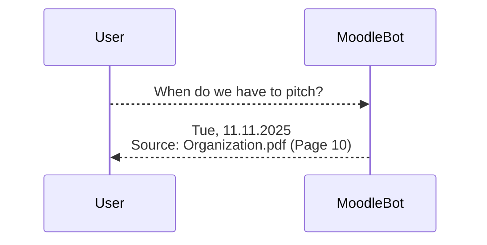
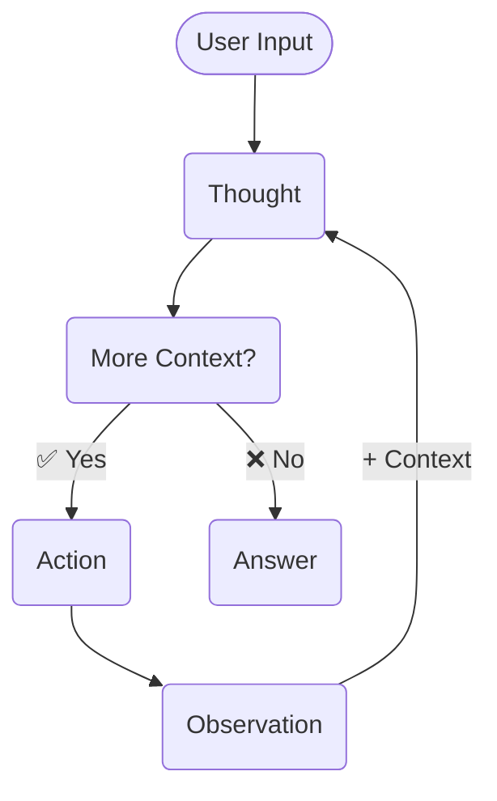

# MoodleBot

An agent chatbot for the Conversation AI course

---
layout: two-cols
---
# What is MoodleBot?

<div v-click class="h-full flex flex-col items-center [&>.mermaid]:w-full [&>.mermaid]:mt-20">


<span>Our Vision</span>
</div>

::right::

<div v-click class="[&>.mermaid]:flex [&>.mermaid]:justify-end">

</div>

---

# Agenda

1. Web App Overview
   - Technology stack
   - UI walkthrough
   - Core features and capabilities

2. Code Deep Dive
   - Project architecture
   - Key components and data flow

3. Extending Agent Capabilities
   - Overview of the agent toolbox
   - Implementing a custom `web_search` tool 
   - Demo and integration

---
layout: center
class: text-left
---

# Web App Overview

- Technology stack
- UI walkthrough
- Core features and capabilities

<br>

```bash
Backend:  http://localhost:8000
Frontend: http://localhost:3000
```

---

# Max Steps Limitation

<v-clicks every="2">

- <lucide-check class="text-green"/> Pros
  - Prevents Infinite Loops
  - Predictable Cost
  - Low Latency

<br>

- <lucide-x class="text-red"/> Cons
  - Wasted Work
  - Limits Intelligence

<br>

- <lucide-construction class="text-yellow mr-1"/>  Solutions
  - Soft Limit
  - Deduplication

</v-clicks>

---
layout: center
class: text-left
---

# Code Deep Dive

- Project architecture
- Key components and data flow

---

# ReflAct (`constructor`)

```python [backend/ai/reflact.py] {all|1-5|7-10|12-21|all}
class ReflActAgent:
    def __init__(self, tools: Dict[str, Callable]):
        self.tools = tools
        tools_desc, tools_priority = build_tools(tools)
        tools_desc.append("### `answer`: Provide final response to user.")

        self.system_prompt = REFLACT_SYSTEM_PROMPT.format(
            tools_description="\n\n".join(tools_desc),
            tools_priority=tools_priority,
        )

# Usage
agent = ReflActAgent(
    tools={
        "search": search,
        "search_lectures": search_lectures,
        "search_exercises": search_exercises,
        "read_file": read_file,
        "list_files": list_files,
    },
)
```

---

# `search_lectures` tool

```python [backend/ai/tools.py] {all|1|2|3-11|13|all}
@register_tool(priority=1, use_case="lectures, theory, deadlines, schedules, concepts")
async def search_lectures(query: str, max_results: int = 5) -> dict:
    """Search lecture slides and PDF scripts only.

    Args:
        query (str): Search query, e.g. "Chain-of-Thought prompting"
        max_results (int): Number of results (default: 5)

    Returns:
        dict: {success, query, count, results}
    """

    return await search(query=query, document_type="script", max_results=max_results)
```

---

# ReflAct (`ReflActResponse`)

```python [backend/ai/reflact.py] {all|1-3|6-8|11-15|all}
class ReflActResponse(BaseModel):
    reflection: Reflection
    action: Action


class Reflection(BaseModel):
    state: str = Field(description="Current information state")
    goal: str = Field(description="User's ultimate objective")


class Action(BaseModel):
    tool: str = Field(description="The tool name to use")
    args: Dict[str, Any] = Field(default_factory=dict, description="Tool arguments")
    reason: str = Field(description="Reasoning for the action")
```

---

# ReflAct (`stream`)

```python [backend/ai/reflact.py] {all|2|3|4-10|11-12|14-15|16-17|18-19|21-22|4-22|14-15|all}
class ReflActAgent:
    async def stream(self, messages: Sequence[Message], model="gpt-4.1-nano", max_steps=10):
        step = 0
        while step < max_steps:
            step += 1
            content = await self.client.chat.completions.create(
                model=model,
                messages=messages,
            )
            response = ReflActResponse.model_validate_json(content)
            tool_name = response.action.tool
            tool_args = response.action.args

            if tool_name == "answer":
                return tool_args.get("text")
            elif tool_name not in self.tools:
                observation = "Invalid action..."
            else:
                observation = await self.tools[tool_name](**tool_args)
            
            messages.append({"role": "assistant", "content": content})
            messages.append({"role": "user", "content": f"Observation: {observation}"})
```

---

# ReflAct (`/api/reflact`)

```python [backend/server.py]
@app.post("/api/reflact")
async def reflact(request: Request):
    agent = ReflActAgent(
        tools={
            "search": search,
            "search_lectures": search_lectures,
            "search_exercises": search_exercises,
            "read_file": read_file,
            "list_files": list_files,
        },
    )

    messages = convert_to_openai_messages(request.messages)
    stream = agent.stream(messages, request.model, request.max_steps)

    return StreamingResponse(
        stream,
        media_type="text/event-stream",
    )
```

---
layout: center
class: text-left
---

# Extending Agent Capabilities

- Overview of the agent toolbox
- Implementing a custom `web_search` tool 
- Demo and integration
---

# `web_search` tool

````md magic-move
```python
async def web_search(query: str, max_results: int = 5) -> dict:
    # from tavily import TavilyClient

    # client = TavilyClient(api_key="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")

    return ToolResult.success({"query": query, "count": 0, "results": []})
```

```python {5-12|all}
async def web_search(query: str, max_results: int = 5) -> dict:
    from tavily import TavilyClient

    client = TavilyClient(api_key="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")
    response = client.search(query=query, max_results=max_results)
    results = [
        {
            "title": r.get("title", ""),
            "url": r.get("url", ""),
            "content": r.get("content", ""),
        }
        for r in response.get("results", [])
    ]

    return ToolResult.success({"query": query, "count": 0, "results": []})
```

```python {14-21|all}
async def web_search(query: str, max_results: int = 5) -> dict:
    from tavily import TavilyClient

    client = TavilyClient(api_key="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")
    response = client.search(query=query, max_results=max_results)
    results = [
        {
            "title": r.get("title", ""),
            "url": r.get("url", ""),
            "content": r.get("content", ""),
        }
        for r in response.get("results", [])
    ]

    return ToolResult.success(
        {"query": query, "count": len(results), "results": results}
    )
```

```python {1,3-7|all}
@register_tool(priority=6, use_case="web search for external info")
async def web_search(query: str, max_results: int = 5) -> dict:
    """Search the web for topics not in course, recent news, external documentation.
    Args:
        query (str): Search query, e.g. "GPT-4 vision capabilities"
        max_results (int): Number of results (default: 5)
    """
    from tavily import TavilyClient

    client = TavilyClient(api_key="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")
    response = client.search(query=query, max_results=max_results)
    results = [
        {
            "title": r.get("title", ""),
            "url": r.get("url", ""),
            "content": r.get("content", ""),
        }
        for r in response.get("results", [])
    ]

    return ToolResult.success(
        {"query": query, "count": len(results), "results": results}
    )
```
````

---
layout: center
---

# Demo `web_search` tool

---

# Hypotheses

Based on the workshop so far, decide whether each hypothesis is supported or not supported.

<Hypotheses v-click />
